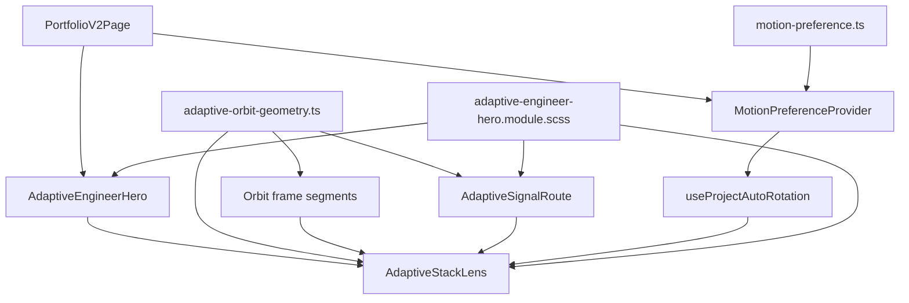

# Hero V2 Engineering Contract

> [!IMPORTANT]
> This document describes a protected production UI contract.
> Source code remains authoritative. If this document conflicts with current
> source, stop and reconcile the discrepancy before editing.

Last verified against `hero-v2-responsive-rebuild` at
`9f8b06719793a20b79d3795606543e7a231cd4d5`.

## Purpose

Hero V2 is the production-quality first viewport served at `/v2`. Its left side
establishes identity and proof; its right side is an interactive four-project
system orbit. The orbit is not generic decoration. One typed geometry model
controls desktop frame, anchors, route endpoints, labels, and active signal.
Tablet/mobile keep the same route metadata and state machine while CSS owns
their linear rail geometry.

Deterministic generated geometry is required because a visual-only adjustment
can otherwise break several contracts at once:

- a marker can move without its connector endpoint;
- frame and active route can stop sharing the same path;
- card growth can collide with marker or label corridors;
- desktop geometry can diverge from tablet/mobile state;
- remounts can restart HOLD or signal timing;
- independent stroke rules can create a cable-over-wire appearance.

Desktop SVG geometry therefore comes from typed source data. CSS scales and
presents it, and separately constructs deterministic tablet/mobile linear
geometry from shared route metadata. Runtime layout measurements construct
neither mode.

## Architecture map

| Responsibility | Source owner | Contract |
| --- | --- | --- |
| Route geometry and metadata | `src/components/portfolio/hero/adaptive-orbit-geometry.ts` | Owns viewBox, anchors, marker semantics, generated paths, frame segments, and orbit-relative CSS values. |
| Hero composition and content boundary | `src/components/portfolio/hero/adaptive-engineer-hero.tsx` | Loads verified project data and composes narrative plus stack lens. |
| Hero narrative data | `src/lib/portfolio/adaptive-hero.ts` | Owns identity, eyebrow, name, statement data, summary, and fundamentals. Current component consumes statement entries 0 and 1 directly and renders the third line with fixed emphasis markup in `adaptive-engineer-hero.tsx`. |
| Navigation | `src/components/portfolio/hero/adaptive-hero-nav.tsx` | Owns desktop/mobile navigation markup, active-section state, dialog focus handling, and navigation labels. |
| Lens editorial data | `src/lib/portfolio/adaptive-stack-lens.ts` | Owns four lens records, labels, card editorial fields, case-study link destinations, accents, and default slug. |
| Lens project projection | `src/lib/portfolio/projects/selectors.ts` | Joins lens records to canonical project technologies. |
| Frame renderer and interaction state | `src/components/portfolio/hero/adaptive-stack-lens.tsx` | Renders `ORBIT_FRAME_SEGMENTS`, markers, labels, card, selection state, keyboard behavior, and rotation status. |
| Active signal renderer | `src/components/portfolio/hero/adaptive-signal-route.tsx` | Selects one generated route and applies the same `desktopPath` to track, progress, and head. |
| Auto-rotation owner | `src/components/portfolio/hero/use-project-auto-rotation.ts` | Owns one pausable 6000ms clock, visibility/viewport gates, interaction HOLD, user pause, and manual-selection cooldown. |
| Motion preference policy | `src/lib/motion-preference.ts` | Parses, persists, resolves, and bootstraps explicit Full/Reduced state. |
| Motion preference React owner | `src/lib/motion-preference-context.tsx` | Publishes current preference, OS diagnostic state, development override, and effective motion. |
| Responsive and signal presentation | `src/styles/portfolio/adaptive-engineer-hero.module.scss` | Owns CSS sizing, layout modes, route cores/halos, animation keyframes, and reduced/forced-color presentation. |



`PortfolioV2Page` is implemented in
`src/components/portfolio/portfolio-v2-page.tsx`. It wraps `/v2` in
`MotionPreferenceProvider` before rendering `AdaptiveEngineerHero`.

## Single source of truth

1. `ORBIT_GEOMETRY` is the geometric source.
2. `buildRoutePath()` derives every desktop route from that source.
3. `SIGNAL_ROUTES` attaches direction and wrap metadata to generated paths.
4. `ORBIT_FRAME_SEGMENTS` reuses those same generated paths.
5. `AdaptiveSignalRoute` assigns one selected `desktopPath` to track, progress,
   and head.
6. `getNodePositionStyle()` projects the same typed anchors to marker positions.
7. CSS may scale/style desktop geometry and owns deterministic tablet/mobile
   linear rails, but it must not recreate desktop SVG route coordinates.
8. Tablet and mobile linear routes are alternate presentations of the same
   `fromIndex`, `toIndex`, `direction`, `wraps`, revision, and rotation state.
   They are not separate interaction models.

The required runtime invariant is:

```text
frame d === track d === progress d === head d
```

For an active route, compare the frame segment whose
`data-frame-segment` is `${fromIndex}-${toIndex}` with all three paths inside
`[data-signal-route-orbit]`.

## Approved route strings

These strings were re-derived from current source values rather than copied
from historical QA output.

| Route | Direction | Wrap | Generated `d` |
| --- | --- | --- | --- |
| `0 -> 1` | forward | false | `M344 36 H564 L588 60 V232` |
| `1 -> 2` | forward | false | `M588 310 V452 L564 476 H344` |
| `2 -> 3` | forward | false | `M296 476 H76 L52 452 V310` |
| `3 -> 0` | reverse | true | `M52 232 V60 L76 36 H296` |

Do not store copies of these strings in another component or stylesheet. Their
durable source is `buildRoutePath()` plus `ORBIT_GEOMETRY`.

## Geometry invariants

| Value | Current source | Semantic meaning |
| --- | --- | --- |
| ViewBox | `640 x 512` | Shared coordinate plane for frame, active paths, anchors, and scaling. |
| Aspect ratio | `640 / 512` (`1.25`) | Prevents route/frame letterboxing and anchor drift. Exported as `--orbit-aspect-ratio`. |
| Top anchor | `(320, 36)` | Center of project marker 01. |
| Right anchor | `(588, 256)` | Center of project marker 02. |
| Bottom anchor | `(320, 476)` | Center of project marker 03. |
| Left anchor | `(52, 256)` | Center of project marker 04. |
| Corner inset | `24` SVG units | Length of each beveled corner transition. |
| Marker size | `36` SVG units | Diameter used by anchor, connector, label, and CSS scaling contracts. |
| Marker radius | `18` SVG units | Half marker size; never substitute a CSS pixel radius in route math. |
| Connector clearance | `6` SVG units | Visible space between a normal route endpoint and marker edge. |
| Center-to-endpoint gap | `24` SVG units | `18` radius plus `6` connector clearance, returned by `getConnectorGap()`. |
| Side-label clearance | `12` SVG units | Extra route corridor below labels 02 and 04. |
| Side-label center offset | `54` SVG units | `24 + 18 + 12`; keeps resumed side route clear of marker and label. |
| Label gap ratio | `0.18` of marker size | Keeps marker-to-label spacing proportional while orbit scales. |
| Label font ratio | `0.345` of marker size | Keeps desktop orbit labels proportional to markers. |

`toOrbitCqi()` converts SVG-unit lengths to container-query inline units using
the `640`-unit viewBox width. Current generated values include:

- marker size: `5.625cqi`;
- label gap: `1.0125cqi`;
- label font size: `1.940625cqi`;
- aspect ratio: `640 / 512`.

The conversion is intentional: markers, labels, and route coordinates stay in
one coordinate plane even when CSS changes orbit size.

## Immutable and adjustable layers

| Layer | Status | Examples |
| --- | --- | --- |
| Geometry topology | Immutable without regression evidence | ViewBox, anchors, marker semantics, route order, corner inset, path identity. |
| Interaction state | Immutable without regression evidence | Pinned/preview ownership, revision behavior, reverse wrap, keyboard navigation, rotation clock. |
| Motion contract | Immutable without regression evidence | 6000ms route clock, 94% arrival, shared frontier, stable-key HOLD/resume, preview remount semantics, effective motion policy. |
| Responsive ownership | Immutable without regression evidence | Desktop SVG orbit, tablet vertical rail/card row, mobile horizontal rail/card row. |
| Visual tokens | Adjustable only with full matrix evidence | Composition gap, bounded orbit/card clamps, route halo strength, orbit-label typography. |
| Content | Multiple explicit owners | Narrative data comes from `adaptive-hero.ts`; four lens records and card editorial fields come from `adaptive-stack-lens.ts`; technologies come through `projects/selectors.ts`; navigation labels come from `adaptive-hero-nav.tsx`; evidence counts and fixed action/proof wording are composed in `adaptive-engineer-hero.tsx`. |

## DO NOT CHANGE WITHOUT EXPLICIT REGRESSION EVIDENCE

Protected behavior includes:

- generated route strings and route order;
- all four marker anchors;
- `connectorGap` meaning and its radius relationship;
- `sideLabelClearance` meaning for markers 02 and 04;
- frame/track/progress/head path identity;
- selection, preview, revision, and auto-rotation ownership;
- tablet/mobile direction metadata and reverse `04 -> 01` wrap;
- `PROJECT_ROTATION_INTERVAL_MS` (`6000`);
- signal arrival at `94%` of route duration;
- frame draw duration (`1100ms`) and its configured delay;
- one shared `--signal-progress` frontier;
- stable-route HOLD freezing both route animation and remaining rotation-clock time;
- stable-route resume continuing rather than restarting;
- preview/selection route replacement remaining explicit: changing active route
  changes the route key and intentionally starts that route at its origin;
- Full, OS diagnostic, stored Full, and explicit Reduced behavior;
- card content and semantic markup;
- left Hero content and proof claims;
- navigation structure and behavior;
- typography outside an explicitly approved orbit-specific adjustment.

Regression evidence means current-source inspection plus repeatable computed
measurements at the failing viewport and adjacent breakpoints. A screenshot or
preference for another implementation is not evidence by itself.

## Forbidden architecture

| Forbidden pattern | Why it is dangerous |
| --- | --- |
| Production `getBoundingClientRect()` geometry | Couples paths to render timing, fonts, zoom, hydration, and transient layout. |
| `ResizeObserver`-driven path generation | Reintroduces asynchronous geometry, feedback loops, and browser-dependent rounding. |
| Runtime marker projection | Allows frame, marker, and route sources to diverge after resize or remount. |
| Device-pixel-ratio or OS-scale branches | Solves one environment by creating another coordinate system. |
| Browser-specific layout branches | Hides broken intrinsic CSS behind user-agent behavior. |
| Per-screen-width corrections | Produces isolated patches instead of one container/viewport model. |
| Per-marker corrections or arbitrary transforms | Breaks anchor symmetry and makes path generation non-semantic. |
| Separate path strings in multiple components | Makes path identity unverifiable and guarantees drift during edits. |
| SVG path regeneration during render | Makes stable geometry depend on component lifecycle and state churn. |
| Viewport listeners for geometry | Duplicates CSS responsibility and introduces synchronization races. |
| JavaScript layout calculations CSS can express | Splits responsive ownership and makes server/client output disagree. |
| Hidden duplicated tracks used for visual weight | Changes perceived thickness and can make one active edge heavier. |
| Removing a route layer without measuring overlap | Can break path identity, diagnostics, or active-route hierarchy. |
| Editing geometry to compensate for a constrained test window | Converts a test-environment defect into production behavior. |

`IntersectionObserver` in `use-project-auto-rotation.ts` is allowed because it
gates activity at a `0.35` intersection ratio; it does not calculate geometry.

## Safe extension rule

Before changing an immutable value, write down the failed invariant, capture
current measurements, identify the single source that owns it, and prove that a
CSS-only correction cannot solve it. If geometry must change, update the typed
source once and verify every derived consumer. Never patch consumers
independently.

## Verification status

- Branch: `hero-v2-responsive-rebuild`
- Commit: `9f8b06719793a20b79d3795606543e7a231cd4d5`
- Verified files: `src/components/portfolio/portfolio-v2-page.tsx`, `src/components/portfolio/hero/adaptive-engineer-hero.tsx`, `src/components/portfolio/hero/adaptive-hero-nav.tsx`, `src/components/portfolio/hero/adaptive-orbit-geometry.ts`, `src/components/portfolio/hero/adaptive-signal-route.tsx`, `src/components/portfolio/hero/adaptive-stack-lens.tsx`, `src/components/portfolio/hero/use-project-auto-rotation.ts`, `src/styles/portfolio/adaptive-engineer-hero.module.scss`, `src/lib/portfolio/adaptive-hero.ts`, `src/lib/portfolio/adaptive-stack-lens.ts`, `src/lib/portfolio/projects/selectors.ts`, `src/lib/motion-preference.ts`, `src/lib/motion-preference-context.tsx`
- Verification date: `2026-08-04`
- Documentation-only change: Yes
